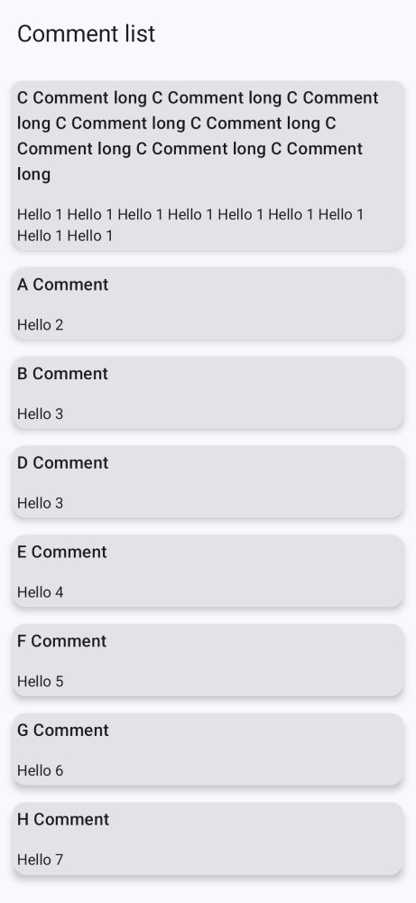
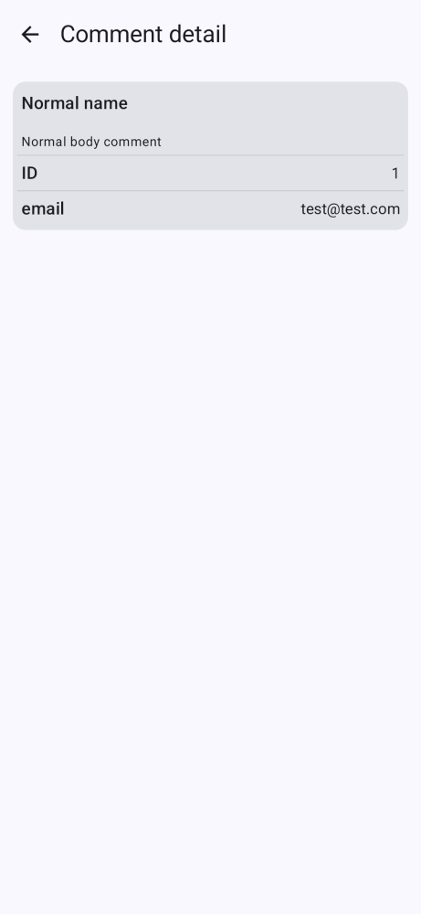
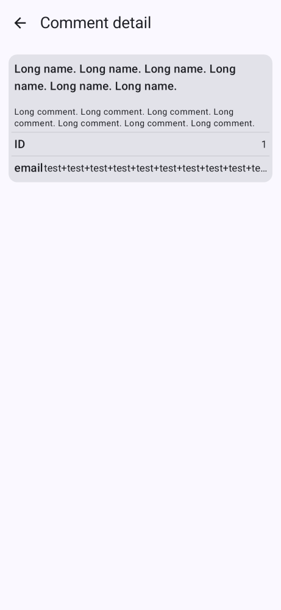

# Tech Test

## Technologies Used

- Kotlin+Coroutines
- Android MVVM architecture (ViewModel+Flows/Repositories/UseCases)
- Jetpack Compose UI
- Hilt for DI
- Networking using Retrofit (okhttp) + Moshi
- Mockito + Paparazzi for testing

## Project Structure

- `/data` -> api/dto/repo
- `/di` -> hilt modules
- `/domain` -> business logic
- `/ui` -> frontend

## UI Details

- Hilt compose navigation
- Scaffold for screen structure
- Stateless UI elements where possible
- Errors show via Snackbar (LaunchedEffect)

## Testing

`app/src/tests` contains unit/integration/ui tests:

- UseCase tests
- ViewModel tests
- API integration test
- Repository tests
- UI snapshot tests ([test report](app/build/reports/paparazzi/debug/index.html))

## Further work

- Instrumentation tests would be nice
- UI tests could be expanded to test across a wide range of device configs
- Proper caching could be added to repository (probably room)
- Use SavedStateHandle in ViewModels
- Navigation structure change to handle tablets

# Paparazzi screenshots

## Comment list - loaded list

## Comment list - empty state

## Comment list - loading state

## Comment detail

## Comment detail - long text

